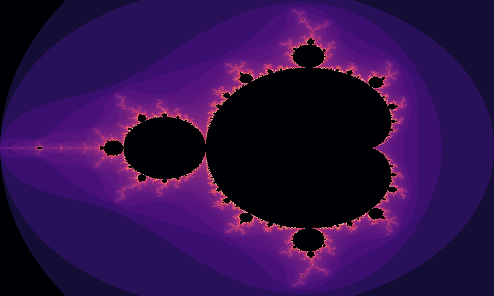
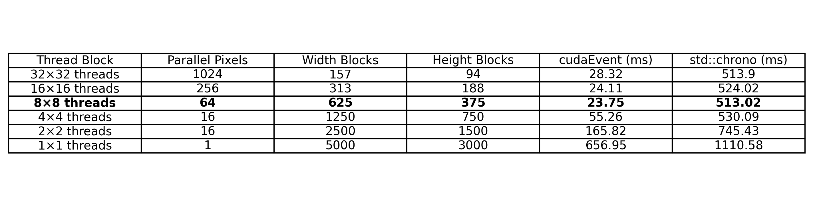

# Mandelbrot Fractal Generator (CUDA)

This project generates a Mandelbrot fractal using GPU acceleration with CUDA and saves it as Mandelbrot_CUDA.png. OpenCV is used for coloring and saving the image.

Compilation:
nvcc -o mandelbrot mandelbrot.cu `pkg-config --cflags --libs opencv4` -lcudart

Usage:
./mandelbrot <width> <height> <max_iterations>

Example:
./mandelbrot 5000 3000 1000

Output:
The fractal will be saved as Mandelbrot_CUDA.png in the current directory.

# Mandelbrot Performance Measurement

Time Measurement Methods:

std::chrono: Measures the total time from kernel launch to completion, including CPU-GPU synchronization and potential overhead.

cudaEvent:   Measures only the GPU kernel execution time, providing a more accurate kernel performance measurement.

Running Times (in milliseconds) on 5000×3000 Images for 1000 Iterations:

Note: The times are the average of 10 consecutive runs.

# GPU Kernel Configurations:

# 64×64 threads (4096 threads in parallel)

ERROR: Invalid for "NVIDIA GeForce GTX 1650"

Maximum number of threads per multiprocessor: 1024

Maximum number of threads per block:          1024

# 32×32 threads (1024 threads in parallel)
Total blocks: 157 (width), 94 (height)

cudaEvent:    28.32 ms

std::chrono: 513.90 ms

# 16×16 threads (256 threads in parallel)
Total blocks: 313 (width), 188 (height)

cudaEvent:    24.11 ms

std::chrono: 524.02 ms

# 8×8 threads (64 threads in parallel)
Total blocks: 625 (width), 375 (height)

cudaEvent:    23.75 ms (Best Time)

std::chrono: 513.02 ms

# 4×4 threads (16 threads in parallel)
Total blocks: 1250 (width), 750 (height)

cudaEvent:    55.26 ms

std::chrono: 530.09 ms

# 2×2 threads (4 threads in parallel)
Total blocks: 2500 (width), 1500 (height)

cudaEvent:   165.82 ms

std::chrono: 745.43 ms

# 1×1 thread (1 thread)
Total blocks: 5000 (width), 3000 (height)

cudaEvent:    656.95 ms

std::chrono: 1110.58 ms

# Extra for 8×8 threads (64 threads in parallel)

__Execution time using cudaEvent: 23.7452 ms__

__Execution time using std::chrono: for generateFractal: 434.684 ms__

Execution time using std::chrono: for new: 0.005023 ms

Execution time using std::chrono: for cudaMalloc: 0.342906 ms

Execution time using std::chrono: for blockSize: 0 ms

Execution time using std::chrono: for gridSize: 0.000284 ms

Execution time using std::chrono: for generateMandelbrotKernel: 1.62335 ms

Execution time using std::chrono: for cudaDeviceSynchronize: 22.2659 ms

__Execution time using std::chrono: for generateMandelbrotKernel + cudaDeviceSynchronize: 23.8893 ms__

Execution time using std::chrono: for cudaEventSynchronize: 0.149559 ms

Execution time using std::chrono: for cudaMemcpy: 4.04151 ms

Execution time using std::chrono: for coloredImage: 11.9221 ms

__Execution time using std::chrono: for imwrite: 121.672 ms__

Execution time using std::chrono: for cudaFree: 0.694151 ms

Execution time using std::chrono: for delete: 0.08132 ms

__Execution time using std::chrono: for delete - new *(actual time in generateFractal)*: 164.684 ms__

