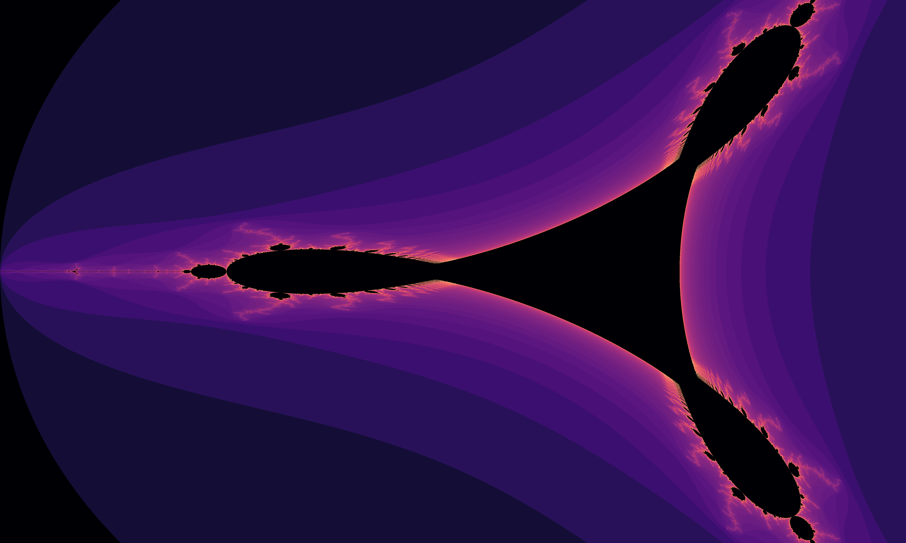

# Fractals: Mandelbrot, Tricorn, Julia & Cosine

This project explores four popular fractals: **Mandelbrot**, **Tricorn**, **Julia** & **Cosine**.

## Hardware Configuration

- **Processor:** Intel(R) Core(TM) i7-10870H
- **Graphics Card:** NVIDIA GeForce GTX 1650 (for GPU execution)

## Running on GPU with CUDA

### 1. Mandelbrot

**Compilation:**
nvcc -o mandelbrot mandelbrot.cu `pkg-config --cflags --libs opencv4` -lcudart

**Execution:**
./mandelbrot 5000 3000 1000

### 2. Tricorn

**Compilation:**
nvcc -o tricorn tricorn.cu `pkg-config --cflags --libs opencv4` -lcudart

**Execution:**
./tricorn 5000 3000 1000

### 3. Julia

**Compilation:**
nvcc -o julia julia.cu `pkg-config --cflags --libs opencv4` -lcudart

**Execution:**
./julia 5000 3000 1000 -0.7 0.27015

### 4. Cosine

**Compilation:**
nvcc -o cosine cosine.cu `pkg-config --cflags --libs opencv4` -lcudart

**Execution:**
./cosine 5000 3000 1000

## Hardware Configuration

### My Own Machine
- **Processor:** Intel(R) Core(TM) i7-10870H
- **Graphics Card:** NVIDIA GeForce GTX 1650 (for GPU execution)

### Server
- **dgxa100:** NVIDIA A100-SXM4-80GB

**Fractals were generated using images with dimensions of 20000x16000 px and a maximum of 2000 iterations.**

In this CUDA setup, with blockSize(8, 8) and image dimensions of __width = 20000__ and __height = 16000__, the grid dimensions are calculated as (2500, 2000), resulting in 5,000,000 blocks and 320,000,000 threads.

The __NVIDIA GeForce GTX 1650__, featuring __896 CUDA cores__ across 14 SMs, distributes these threads across the available cores in multiple rounds. However, the total number of active cores is limited to __896__.

The __NVIDIA A100-SXM4-80GB__, featuring __6,912 CUDA cores__ across 108 SMs, distributes these threads across the available cores in multiple rounds. Similarly, the total number of active cores is limited to __6,912__.

Below are the execution times obtained for each fractal (averaged over five consecutive runs per fractal):

### 1. Serial

- _Mandelbrot:_ 546866 ms
- _Tricorn:_ 152403 ms
- _Julia:_ 84280 ms
- _Cosine:_ 13264120 ms (through interpolation for 20000x16000 px, data was only available for the cosine up to 16384x8192 px)

### 2. Parallel @ NVIDIA GeForce GTX 1650

| Fractal       | CPU+GPU (ms) | GPU (ms) |
|---------------|--------------|----------|
| Mandelbrot    | 3453         | 770      |
| Tricorn       | 2985         | 420      |
| Julia         | 3503         | 206      |
| Cosine        | 14590        | 11376    |

### 3. Parallel @ NVIDIA A100-SXM4-80GB

| Fractal       | CPU+GPU (ms) | GPU (ms) |
|---------------|--------------|----------|
| Mandelbrot    | 7205         | 147      |
| Tricorn       | 7119         | 78       |
| Julia         | 7728         | 35       |
| Cosine        | 8610         | 1897     |

For the results obtained from generating four types of fractals using parallel execution on CUDA, the SpeedUp was calculated by comparing Tserial (the execution time on a single processor) and Tparallel (which includes GPU processing time for fractal generation and CPU time for tasks such as copying data back to the CPU, image creation, and color application using OpenCV).

Efficiency is typically calculated by dividing the SpeedUp by the number of processors. However, this approach is not entirely accurate in this context, as CUDA processors are used only during the GPU phase for fractal generation, while a significant portion of the total execution time is spent on CPU tasks, such as data transfer and image construction, which reduces overall efficiency.

In the image below, the efficiency of the personal machine was divided by the efficiency of the server to simplify Tserial and, for Tparallel, to directly compare the time required for fractal execution (GPU time).

If the efficiency on the personal machine is higher than on the server, it is because the personal GPU has enough cores to handle these fairly large images (over 16k resolution) efficiently. However, for larger images that don't fit into the personal GPU's memory, the server, with more cores and a larger memory capacity, would likely be more efficient.

