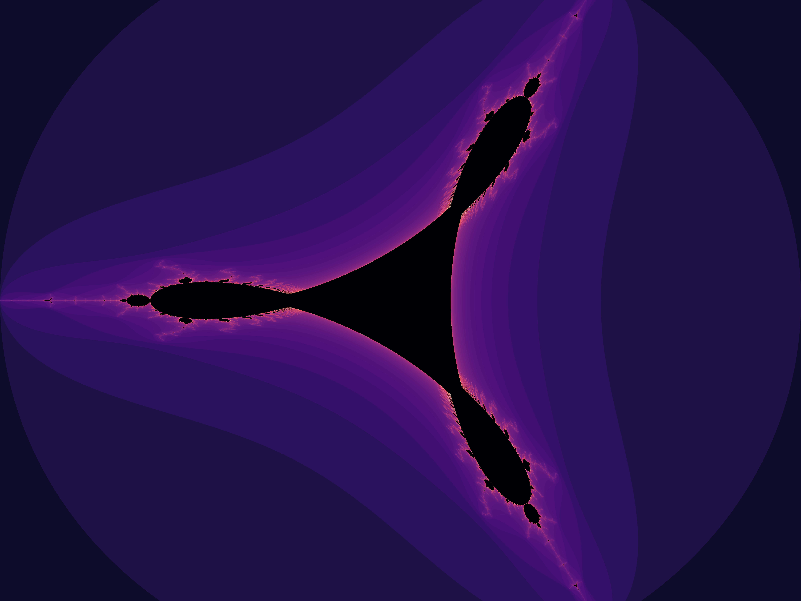

# Fractal Image Generation

## Team Members

- [Cristian Cristea](@cristian.cristea) (TBB)
- [Antonio Lăzărescu](@antonio.lazarescu) (CUDA)
- [Franciso Câmara](@francisco.bessa) (OpenMP)
- [Mihaela Țigănoiu](@maria.tiganoiu) (pthreads)

## Implementations

- [Serial](Serial/README.md)
- [TBB](TBB/README.md)
- [CUDA](CUDA/README.md)
- [OpenMP](OpenMP/README.md)
- [pthreads](pthreads/README.md)

## Dependencies

We use [OpenCV](https://github.com/opencv/opencv) for writing the images to disk. 

To install it on _Ubuntu_, run:

```bash
sudo apt-get install libopencv-dev
```

To install it on _Fedora_, run:

```bash
sudo dnf install opencv opencv-devel
```

## Theory

Fractals are complex structures that exhibit self-similarity across varying scales and are frequently studied in mathematics, computer science, and natural sciences for their intricate beauty and unique properties. Defined as geometric shapes that can be split into parts, each of which is a reduced-scale copy of the whole, fractals can be observed in both natural forms, such as snowflakes, mountain ranges, and coastlines, as well as in artificially generated visuals. Fractal geometry, pioneered by Benoît B. Mandelbrot in the late 20th century, diverges from classical Euclidean geometry by describing irregular, fragmented shapes and surfaces with potentially infinite detail. Fractals have become essential for studying chaotic systems, modeling complex natural phenomena, and for computational generation in various applications, including graphics, image compression, and complex simulations.

### The Mandelbrot Fractal

The Mandelbrot set is one of the most famous fractals and serves as an archetype for studying complex dynamical systems. It is defined by iterating the function:

$$ f_c(z) = z^2 + c $$

where $z$ and $c$ are complex numbers, and $z$ starts at zero. The set consists of points $c$ in the complex plane for which the sequence of iterated values remains bounded. In other words, if we continuously apply the function $f_c$​ and the result does not tend toward infinity, then $c$ is considered part of the Mandelbrot set.

The boundary of the Mandelbrot set exhibits an infinitely complex structure, with self-similar shapes appearing at various scales. The complexity arises because each point requires repeated iterations to determine whether it will escape to infinity or remain bounded, making it ideal for parallel computation. Each pixel in a graphical representation of the Mandelbrot set corresponds to a point in the complex plane, and its color indicates the rate at which the iterated sequence diverges. By computing multiple points simultaneously, parallel computing significantly speeds up the rendering of the Mandelbrot set.

### The Julia Fractal

Julia sets are closely related to the Mandelbrot set and are also defined by iterating complex functions. Unlike the Mandelbrot set, which iterates with different values of $c$, a Julia set fixes a particular value of $c$ and iterates:

$$ f(z) = z^2 + c $$

for each point $z$ in the complex plane. The structure of the resulting Julia set depends on the specific choice of $c$. If $c$ lies within the Mandelbrot set, the corresponding Julia set is a connected fractal. If $c$ is outside the Mandelbrot set, the Julia set is typically a disconnected "dust" of points.

Julia sets are particularly interesting because they exhibit a diverse range of structures based on the initial value of $c$. Like the Mandelbrot set, they display self-similarity and intricate boundary regions. The computational requirements for Julia sets are similar to those of the Mandelbrot set, making them well-suited for parallel computation. By fixing $c$ and iterating through different values of $z$, each point can be independently computed, allowing for parallel rendering across a grid.

### The Tricorn Fractal

The Tricorn fractal, also known as the Mandelbar set, is a variation of the Mandelbrot set. It is generated by iterating the function:

$$ f_c(z) = \overline{z}^2 + c $$

where $\overline{z}$ is the complex conjugate of $z$. This small change in the function introduces a degree of reflection symmetry in the fractal, resulting in a three-pronged structure that gives the Tricorn its name. Like the Mandelbrot set, the Tricorn fractal consists of points in the complex plane where the iteration remains bounded.

The Tricorn is noted for its unusual structure and complex boundary, which is not seen in other traditional fractals. Its threefold symmetry makes it visually distinct and interesting to study, and it also benefits from parallel computing techniques for efficient rendering. Each point in the Tricorn fractal can be computed independently, so it is possible to parallelize the calculations across multiple processors or threads.

### The Cosine Fractal

Cosine fractals are created by iterating functions involving trigonometric transformations, such as:

$$ f_c(z) = \cos(z) + c $$

These fractals differ from the polynomial-based Mandelbrot and Julia sets, as the cosine function introduces periodicity and distinct structural characteristics. Cosine fractals can produce highly intricate, organic patterns that diverge significantly from the typical symmetry seen in polynomial fractals.

One notable feature of cosine fractals is the influence of the periodic nature of the cosine function, which introduces repeating patterns within the fractal structure. The generation of these fractals is computationally intensive, requiring high iteration counts to resolve the details, especially near the boundaries of the set. Due to the nature of the cosine function, cosine fractals often exhibit rapidly changing structures that are computationally challenging to calculate, making them excellent candidates for parallelization.

## Methodology

The generation of each fractal described involves repeated iteration of a mathematical function over a grid of complex values, where each point is calculated independently. This property aligns well with parallel computation, where independent calculations can be distributed across multiple processors or cores, significantly reducing computation time. Typically, fractal generation algorithms divide the complex plane into small, discrete pixels, with each pixel corresponding to a specific complex number. The chosen fractal function is applied iteratively, and the iteration count is tracked to determine the color or shading of each pixel in the fractal image. Points are color-coded based on their escape rate, providing an intuitive visualization of the fractal's structure.

In a parallel computing context, each point in the fractal can be processed concurrently, making it feasible to generate high-resolution fractal images in a fraction of the time required by a single-threaded computation. Moreover, fractals like the Mandelbrot and Julia sets often require deep iteration depths to capture the subtle boundary details, which would be prohibitively slow without parallel processing.

## Examples

### Mandelbrot


### Julia


### Tricorn



### Cosine

