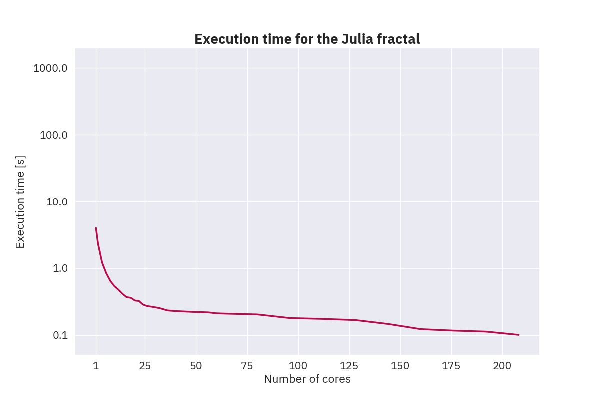

# Fractal Image Generation using TBB

## Initial Code Profiling

Running times (in milliseconds) on 5000×3000 images for 1000 iterations:

- _Mandelbrot:_ 12 753 ms
- _Julia:_ 3 961 ms
- _Tricorn:_ 3 860 ms
- _Cosine:_ 308 981 ms

---

### Mandelbrot

#### CPU Utilisation

#### Top Hotspots

---

### Julia

#### CPU Utilisation

#### Top Hotspots

---

### Tricorn

#### CPU Utilisation

#### Top Hotspots

---

### Cosine

#### CPU Utilisation

#### Top Hotspots

### Small optimisations

After analysing the above hotspots, I made the following small optimisations:

- I used a constant for the escape radius instread of getting it from a virtual function.
- I used the `std::abs` function instead of the `std::norm` function to check the magnitude of a complex number. It seems that the `std::norm` function is slower than the `std::abs` function.

Running times (in milliseconds) on 5000×3000 images for 1000 iterations:

- _Mandelbrot:_ 6 900 ms
- _Julia:_ 2 148 ms
- _Tricorn:_ 2 157 ms
- _Cosine:_ 301 380 ms

## TBB Research

- I installed the `TBB` library on my machine along with the `GCC`, `Clang`, and `Intel` compilers.
- I have looked over the `TBB` [documentation](https://www.intel.com/content/www/us/en/docs/onetbb/developer-guide-api-reference/2022-0/overview.html) and some [examples and tutorials](https://oneapi-src.github.io/oneTBB/index.html).
- I have implemented a [QuisckSort](../TBB-QuickSort) algorithm using `TBB` and compared it with the Standard Template Library (STL) implementation.

## Analysis

<!--
Running times (in milliseconds) on 5000×3000 images for 1000 iterations:

- _Mandelbrot:_ 849 ms
- _Julia:_ 253 ms
- _Tricorn:_ 273 ms
- _Cosine:_ 46 451 ms

### Mandelbrot

#### CPU Utilisation

#### Worker Utilisation

---

### Julia

#### CPU Utilisation

#### Worker Utilisation

---

### Tricorn

#### CPU Utilisation

#### Worker Utilisation

---

### Cosine

#### CPU Utilisation

#### Worker Utilisation

-->

<!-- Serial running times (in milliseconds) on 5000×3000 images for 1000 iterations (on the PRECIS cluster):

- _Mandelbrot:_ 12 229 ms
- _Julia:_ 3 877 ms
- _Tricorn:_ 3 689 ms
- _Cosine:_ 315 814 ms

### Mandelbrot

| Implementation |     2 |     5 |    10 |   15 |   20 |   25 |   50 |   75 |  100 |  150 |  200 |
| :------------- | ----: | ----: | ----: | ---: | ---: | ---: | ---: | ---: | ---: | ---: | ---: |
| Row            | 5 029 | 2 002 | 1 085 |  739 |  604 |  522 |  302 |  226 |  230 |  183 |  133 |
| Column         | 5 035 | 1 961 | 1 086 |  752 |  588 |  497 |  309 |  243 |  255 |  174 |  156 |
| Block          | 4 194 | 1 982 | 1 184 |  732 |  584 |  496 |  385 |  278 |  272 |  189 |  140 |

### Julia

| Implementation |     2 |    5 |   10 |   15 |   20 |   25 |   50 |   75 |  100 |  150 |  200 |
| :------------- | ----: | ---: | ---: | ---: | ---: | ---: | ---: | ---: | ---: | ---: | ---: |
| Row            | 1 466 |  728 |  362 |  283 |  230 |  237 |  172 |  185 |  145 |  114 |   56 |
| Column         | 1 447 |  732 |  368 |  309 |  228 |  205 |  152 |  149 |  159 |  116 |   58 |
| Block          | 1 285 |  671 |  372 |  276 |  249 |  205 |  157 |  162 |  167 |  121 |  102 |

### Tricorn

| Implementation |     2 |    5 |   10 |   15 |   20 |   25 |   50 |   75 |  100 |  150 |  200 |
| :------------- | ----: | ---: | ---: | ---: | ---: | ---: | ---: | ---: | ---: | ---: | ---: |
| Row            | 1 426 |  672 |  359 |  276 |  234 |  209 |  158 |  177 |  151 |  127 |   59 |
| Column         | 1 461 |  651 |  372 |  290 |  208 |  194 |  149 |  167 |  154 |  103 |   57 |
| Block          | 1 202 |  638 |  373 |  315 |  248 |  265 |  166 |  165 |  164 |  113 |   76 |

### Cosine

| Implementation |       2 |      5 |     10 |     15 |     20 |     25 |    50 |    75 |   100 |   150 |   200 |
| :------------- | ------: | -----: | -----: | -----: | -----: | -----: | ----: | ----: | ----: | ----: | ----: |
| Row            | 151 464 | 59 594 | 30 885 | 20 471 | 15 497 | 12 508 | 6 915 | 5 267 | 4 572 | 2 928 | 2 395 |
| Column         | 153 645 | 59 488 | 30 575 | 20 665 | 15 386 | 12 290 | 6 986 | 5 372 | 4 511 | 2 828 | 2 243 |
| Block          | 133 715 | 58 923 | 29 733 | 20 141 | 15 168 | 12 219 | 6 884 | 5 259 | 4 437 | 2 694 | 2 138 |

 -->

### Mandelbrot

|      1 |      2 |     4 |     6 |     8 |    10 |    12 |    14 |    16 |    18 |    20 |    22 |    24 |    26 |    28 |    32 |   36 |   40 |   44 |   48 |   52 |   56 |   60 |   64 |   80 |   96 |  112 |  128 |  144 |  160 |  176 |  192 |  208 |
| -----: | -----: | ----: | ----: | ----: | ----: | ----: | ----: | ----: | ----: | ----: | ----: | ----: | ----: | ----: | ----: | ---: | ---: | ---: | ---: | ---: | ---: | ---: | ---: | ---: | ---: | ---: | ---: | ---: | ---: | ---: | ---: | ---: |
| 25 843 | 15 529 | 7 932 | 5 248 | 4 050 | 3 183 | 2 676 | 2 349 | 2 020 | 1 835 | 1 671 | 1 518 | 1 359 | 1 284 | 1 225 | 1 102 |  952 |  884 |  836 |  789 |  773 |  719 |  682 |  694 |  569 |  512 |  491 |  384 |  367 |  341 |  319 |  283 |  243 |

### Julia

|     1 |     2 |     4 |    6 |    8 |   10 |   12 |   14 |   16 |   18 |   20 |   22 |   24 |   26 |   28 |   32 |   36 |   40 |   44 |   48 |   52 |   56 |   60 |   64 |   80 |   96 |  112 |  128 |  144 |  160 |  176 |  192 |  208 |
| ----: | ----: | ----: | ---: | ---: | ---: | ---: | ---: | ---: | ---: | ---: | ---: | ---: | ---: | ---: | ---: | ---: | ---: | ---: | ---: | ---: | ---: | ---: | ---: | ---: | ---: | ---: | ---: | ---: | ---: | ---: | ---: | ---: |
| 3 988 | 2 324 | 1 216 |  848 |  648 |  541 |  477 |  414 |  370 |  362 |  330 |  324 |  287 |  272 |  267 |  254 |  234 |  229 |  226 |  223 |  221 |  219 |  212 |  210 |  204 |  180 |  175 |  168 |  147 |  123 |  117 |  113 |  101 |

### Tricorn

|     1 |     2 |     4 |     6 |     8 |   10 |   12 |   14 |   16 |   18 |   20 |   22 |   24 |   26 |   28 |   32 |   36 |   40 |   44 |   48 |   52 |   56 |   60 |   64 |   80 |   96 |  112 |  128 |  144 |  160 |  176 |  192 |  208 |
| ----: | ----: | ----: | ----: | ----: | ---: | ---: | ---: | ---: | ---: | ---: | ---: | ---: | ---: | ---: | ---: | ---: | ---: | ---: | ---: | ---: | ---: | ---: | ---: | ---: | ---: | ---: | ---: | ---: | ---: | ---: | ---: | ---: |
| 6 571 | 4 128 | 2 235 | 1 418 | 1 095 |  922 |  780 |  668 |  603 |  579 |  553 |  493 |  480 |  439 |  418 |  359 |  336 |  325 |  313 |  305 |  302 |  291 |  280 |  271 |  259 |  242 |  224 |  237 |  189 |  160 |  150 |  145 |  131 |

### Cosine

|       1 |       2 |       4 |       6 |       8 |     10 |     12 |     14 |     16 |     18 |     20 |     22 |     24 |     26 |     28 |     32 |     36 |     40 |     44 |     48 |     52 |     56 |     60 |     64 |     80 |     96 |    112 |    128 |   144 |   160 |   176 |   192 |   208 |
| ------: | ------: | ------: | ------: | ------: | -----: | -----: | -----: | -----: | -----: | -----: | -----: | -----: | -----: | -----: | -----: | -----: | -----: | -----: | -----: | -----: | -----: | -----: | -----: | -----: | -----: | -----: | -----: | ----: | ----: | ----: | ----: | ----: |
| 843 808 | 480 895 | 240 900 | 161 441 | 120 677 | 96 542 | 80 538 | 68 821 | 60 244 | 53 606 | 48 301 | 43 829 | 40 515 | 37 890 | 34 535 | 30 192 | 26 875 | 25 582 | 22 820 | 21 043 | 20 602 | 19 685 | 19 064 | 18 151 | 15 645 | 14 023 | 13 093 | 10 856 | 9 006 | 8 089 | 7 529 | 6 939 | 6 371 |

