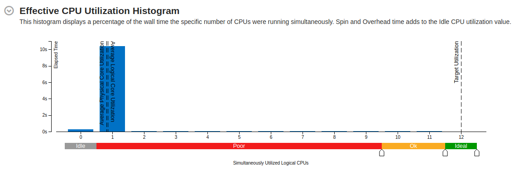

# Fractal Image Generation using TBB

## Initial Code Profiling

Running times:

- _Mandelbrot:_ 12 753 ms
- _Julia:_ 3 961 ms
- _Tricorn:_ 3 860 ms
- _Cosine:_ 308 981 ms

---

### Mandelbrot

#### CPU Utilisation

#### Top Hotspots

---

### Julia

#### CPU Utilisation

#### Top Hotspots

---

### Tricorn

#### CPU Utilisation

#### Top Hotspots

---

### Cosine

#### CPU Utilisation

#### Top Hotspots

