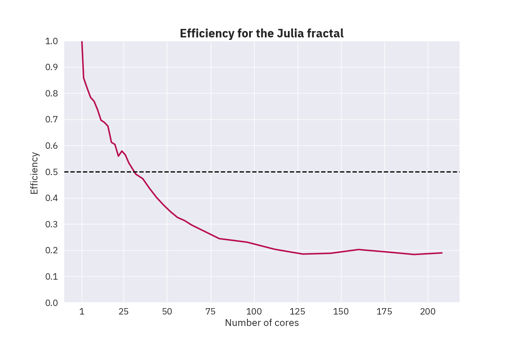
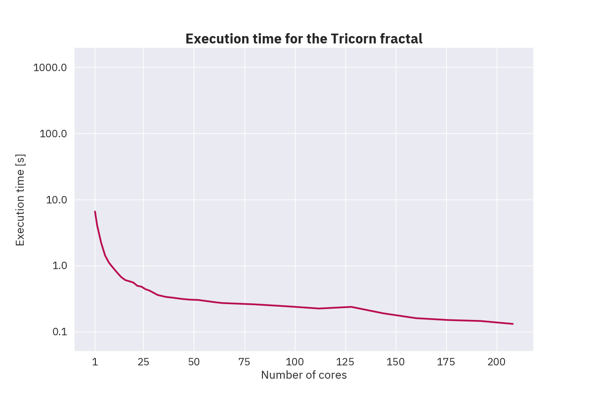
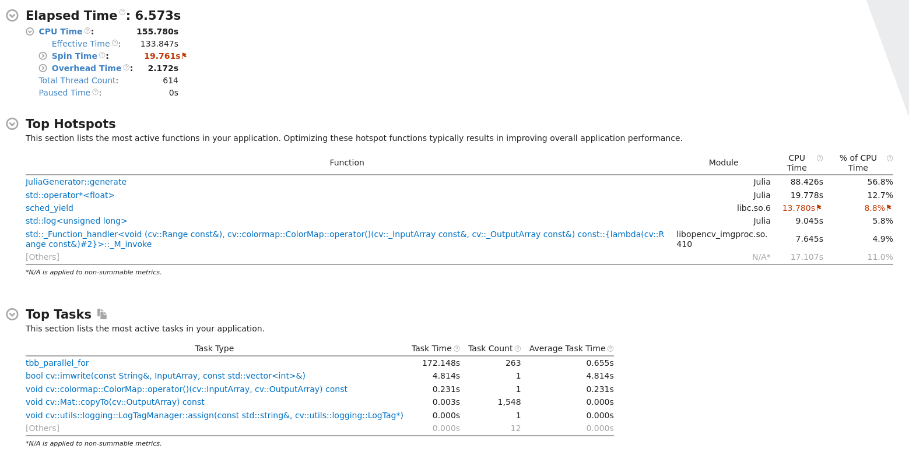
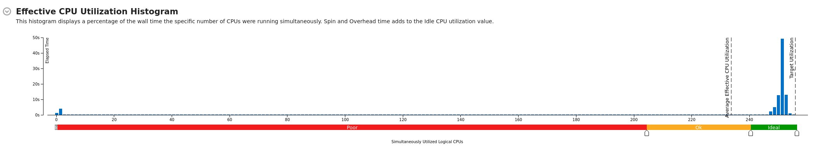

# Fractal Image Generation using TBB

## Initial Serial Code Profiling

Running times on 5000×3000 images for 1000 iterations:

- _Mandelbrot:_ 12 753 ms
- _Julia:_ 3 961 ms
- _Tricorn:_ 3 860 ms
- _Cosine:_ 308 981 ms

---

### Mandelbrot

#### CPU Utilisation

#### Top Hotspots

---

### Julia

#### CPU Utilisation

#### Top Hotspots

---

### Tricorn

#### CPU Utilisation

#### Top Hotspots

---

### Cosine

#### CPU Utilisation

#### Top Hotspots

### Small optimisations

After analysing the above hotspots, I made the following small optimisations:

- I used a constant for the escape radius instread of getting it from a virtual function.
- I used the `std::abs` function instead of the `std::norm` function to check the magnitude of a complex number. It seems that the `std::norm` function is slower than the `std::abs` function.

Running times (in milliseconds) on 5000×3000 images for 1000 iterations:

- _Mandelbrot:_ 6 900 ms
- _Julia:_ 2 148 ms
- _Tricorn:_ 2 157 ms
- _Cosine:_ 301 380 ms

## TBB Research

- I installed the `TBB` library on my machine along with the `GCC`, `Clang`, and `Intel` compilers.
- I have looked over the `TBB` [documentation](https://www.intel.com/content/www/us/en/docs/onetbb/developer-guide-api-reference/2022-0/overview.html) and some [examples and tutorials](https://oneapi-src.github.io/oneTBB/index.html).
- I have implemented a [QuisckSort](../TBB-QuickSort) algorithm using `TBB` and compared it with the Standard Template Library (STL) implementation.

## Performance Analysis

### Mandelbrot

Click for raw data

|      1 |      2 |     4 |     6 |     8 |    10 |    12 |    14 |    16 |    18 |    20 |    22 |    24 |    26 |    28 |    32 |   36 |   40 |   44 |   48 |   52 |   56 |   60 |   64 |   80 |   96 |  112 |  128 |  144 |  160 |  176 |  192 |  208 |
| -----: | -----: | ----: | ----: | ----: | ----: | ----: | ----: | ----: | ----: | ----: | ----: | ----: | ----: | ----: | ----: | ---: | ---: | ---: | ---: | ---: | ---: | ---: | ---: | ---: | ---: | ---: | ---: | ---: | ---: | ---: | ---: | ---: |
| 25 843 | 15 529 | 7 932 | 5 248 | 4 050 | 3 183 | 2 676 | 2 349 | 2 020 | 1 835 | 1 671 | 1 518 | 1 359 | 1 284 | 1 225 | 1 102 |  952 |  884 |  836 |  789 |  773 |  719 |  682 |  694 |  569 |  512 |  491 |  384 |  367 |  341 |  319 |  283 |  243 |

### Julia

Click for raw data

|     1 |     2 |     4 |    6 |    8 |   10 |   12 |   14 |   16 |   18 |   20 |   22 |   24 |   26 |   28 |   32 |   36 |   40 |   44 |   48 |   52 |   56 |   60 |   64 |   80 |   96 |  112 |  128 |  144 |  160 |  176 |  192 |  208 |
| ----: | ----: | ----: | ---: | ---: | ---: | ---: | ---: | ---: | ---: | ---: | ---: | ---: | ---: | ---: | ---: | ---: | ---: | ---: | ---: | ---: | ---: | ---: | ---: | ---: | ---: | ---: | ---: | ---: | ---: | ---: | ---: | ---: |
| 3 988 | 2 324 | 1 216 |  848 |  648 |  541 |  477 |  414 |  370 |  362 |  330 |  324 |  287 |  272 |  267 |  254 |  234 |  229 |  226 |  223 |  221 |  219 |  212 |  210 |  204 |  180 |  175 |  168 |  147 |  123 |  117 |  113 |  101 |

### Tricorn

Click for raw data

|     1 |     2 |     4 |     6 |     8 |   10 |   12 |   14 |   16 |   18 |   20 |   22 |   24 |   26 |   28 |   32 |   36 |   40 |   44 |   48 |   52 |   56 |   60 |   64 |   80 |   96 |  112 |  128 |  144 |  160 |  176 |  192 |  208 |
| ----: | ----: | ----: | ----: | ----: | ---: | ---: | ---: | ---: | ---: | ---: | ---: | ---: | ---: | ---: | ---: | ---: | ---: | ---: | ---: | ---: | ---: | ---: | ---: | ---: | ---: | ---: | ---: | ---: | ---: | ---: | ---: | ---: |
| 6 571 | 4 128 | 2 235 | 1 418 | 1 095 |  922 |  780 |  668 |  603 |  579 |  553 |  493 |  480 |  439 |  418 |  359 |  336 |  325 |  313 |  305 |  302 |  291 |  280 |  271 |  259 |  242 |  224 |  237 |  189 |  160 |  150 |  145 |  131 |

### Cosine

Click for raw data

|       1 |       2 |       4 |       6 |       8 |     10 |     12 |     14 |     16 |     18 |     20 |     22 |     24 |     26 |     28 |     32 |     36 |     40 |     44 |     48 |     52 |     56 |     60 |     64 |     80 |     96 |    112 |    128 |   144 |   160 |   176 |   192 |   208 |
| ------: | ------: | ------: | ------: | ------: | -----: | -----: | -----: | -----: | -----: | -----: | -----: | -----: | -----: | -----: | -----: | -----: | -----: | -----: | -----: | -----: | -----: | -----: | -----: | -----: | -----: | -----: | -----: | ----: | ----: | ----: | ----: | ----: |
| 843 808 | 480 895 | 240 900 | 161 441 | 120 677 | 96 542 | 80 538 | 68 821 | 60 244 | 53 606 | 48 301 | 43 829 | 40 515 | 37 890 | 34 535 | 30 192 | 26 875 | 25 582 | 22 820 | 21 043 | 20 602 | 19 685 | 19 064 | 18 151 | 15 645 | 14 023 | 13 093 | 10 856 | 9 006 | 8 089 | 7 529 | 6 939 | 6 371 |

## Grainsize Analysis

### Mandelbrot

Click for raw data

| Height \ Width |    1 |    2 |    5 |   10 |   15 |   20 |   25 |   50 |  100 |  150 |  200 |  500 | 1000 |
| -------------: | ---: | ---: | ---: | ---: | ---: | ---: | ---: | ---: | ---: | ---: | ---: | ---: | ---: |
|          **1** |  505 |  522 |  517 |  521 |  504 |  521 |  498 |  514 |  543 |  498 |  541 |  510 |  530 |
|          **2** |  542 |  535 |  523 |  546 |  536 |  525 |  508 |  531 |  513 |  535 |  527 |  522 |  507 |
|          **5** |  489 |  533 |  527 |  522 |  537 |  518 |  509 |  526 |  518 |  540 |  543 |  506 |  532 |
|         **10** |  560 |  506 |  511 |  524 |  519 |  512 |  521 |  528 |  530 |  525 |  527 |  563 |  578 |
|         **15** |  515 |  532 |  521 |  531 |  529 |  528 |  512 |  489 |  512 |  538 |  515 |  554 |  578 |
|         **20** |  541 |  519 |  531 |  508 |  521 |  523 |  511 |  518 |  516 |  519 |  561 |  560 |  608 |
|         **25** |  506 |  541 |  542 |  514 |  532 |  532 |  524 |  514 |  537 |  521 |  505 |  540 |  610 |
|         **50** |  547 |  504 |  529 |  556 |  517 |  504 |  532 |  532 |  545 |  523 |  537 |  631 |  707 |
|        **100** |  518 |  530 |  550 |  524 |  535 |  508 |  527 |  508 |  547 |  553 |  557 |  728 |  879 |
|        **150** |  534 |  547 |  520 |  528 |  532 |  548 |  522 |  516 |  567 |  579 |  616 |  754 | 1335 |
|        **200** |  520 |  527 |  524 |  552 |  521 |  537 |  550 |  569 |  575 |  620 |  730 |  887 | 1395 |
|        **500** |  501 |  548 |  525 |  522 |  590 |  561 |  532 |  602 |  728 |  752 |  900 | 1333 | 2500 |
|       **1000** |  540 |  535 |  562 |  568 |  594 |  625 |  579 |  735 |  896 | 1404 | 1427 | 2512 | 3688 |

### Julia

Click for raw data

| Height \ Width |    1 |    2 |    5 |   10 |   15 |   20 |   25 |   50 |  100 |  150 |  200 |  500 | 1000 |
| -------------: | ---: | ---: | ---: | ---: | ---: | ---: | ---: | ---: | ---: | ---: | ---: | ---: | ---: |
|          **1** |  151 |  162 |  162 |  179 |  173 |  167 |  177 |  153 |  173 |  149 |  177 |  158 |  168 |
|          **2** |  151 |  147 |  173 |  141 |  155 |  163 |  153 |  177 |  187 |  178 |  172 |  167 |  167 |
|          **5** |  141 |  155 |  179 |  146 |  174 |  168 |  164 |  164 |  177 |  150 |  171 |  181 |  143 |
|         **10** |  172 |  158 |  157 |  183 |  174 |  178 |  141 |  168 |  179 |  181 |  170 |  180 |  175 |
|         **15** |  172 |  181 |  173 |  172 |  166 |  170 |  184 |  177 |  171 |  173 |  173 |  187 |  154 |
|         **20** |  155 |  170 |  156 |  170 |  171 |  178 |  150 |  179 |  171 |  170 |  148 |  194 |  178 |
|         **25** |  147 |  159 |  166 |  156 |  140 |  150 |  161 |  180 |  147 |  157 |  178 |  179 |  189 |
|         **50** |  181 |  179 |  171 |  180 |  180 |  179 |  164 |  164 |  144 |  184 |  150 |  186 |  193 |
|        **100** |  159 |  166 |  137 |  179 |  178 |  180 |  189 |  174 |  189 |  149 |  162 |  179 |  231 |
|        **150** |  177 |  176 |  152 |  167 |  167 |  164 |  186 |  171 |  164 |  157 |  191 |  227 |  288 |
|        **200** |  180 |  182 |  178 |  178 |  182 |  174 |  180 |  177 |  185 |  180 |  218 |  262 |  308 |
|        **500** |  180 |  177 |  172 |  186 |  174 |  187 |  190 |  186 |  227 |  207 |  233 |  333 |  488 |
|       **1000** |  184 |  162 |  175 |  184 |  168 |  180 |  185 |  215 |  241 |  313 |  353 |  409 |  535 |

### Tricorn

Click for raw data

| Height \ Width |    1 |    2 |    5 |   10 |   15 |   20 |   25 |   50 |  100 |  150 |  200 |  500 | 1000 |
| -------------: | ---: | ---: | ---: | ---: | ---: | ---: | ---: | ---: | ---: | ---: | ---: | ---: | ---: |
|          **1** |  232 |  208 |  226 |  256 |  204 |  239 |  227 |  221 |  247 |  215 |  225 |  227 |  224 |
|          **2** |  218 |  236 |  229 |  250 |  226 |  219 |  219 |  225 |  249 |  197 |  227 |  219 |  230 |
|          **5** |  223 |  206 |  218 |  243 |  217 |  230 |  205 |  237 |  244 |  228 |  230 |  219 |  241 |
|         **10** |  212 |  227 |  231 |  231 |  202 |  194 |  209 |  245 |  224 |  225 |  219 |  242 |  235 |
|         **15** |  211 |  216 |  214 |  228 |  212 |  235 |  219 |  207 |  239 |  229 |  226 |  249 |  258 |
|         **20** |  209 |  234 |  228 |  234 |  225 |  234 |  197 |  252 |  249 |  237 |  244 |  260 |  305 |
|         **25** |  237 |  221 |  196 |  229 |  247 |  236 |  223 |  232 |  221 |  220 |  218 |  273 |  315 |
|         **50** |  210 |  240 |  239 |  219 |  237 |  242 |  237 |  229 |  214 |  255 |  271 |  318 |  415 |
|        **100** |  225 |  211 |  208 |  237 |  228 |  253 |  230 |  214 |  226 |  268 |  265 |  517 |  635 |
|        **150** |  196 |  203 |  212 |  206 |  210 |  244 |  225 |  229 |  270 |  306 |  352 |  485 |  971 |
|        **200** |  213 |  228 |  227 |  237 |  218 |  228 |  246 |  266 |  270 |  362 |  459 |  637 |  910 |
|        **500** |  229 |  203 |  237 |  241 |  281 |  314 |  267 |  339 |  422 |  494 |  562 |  922 |  912 |
|       **1000** |  230 |  205 |  198 |  235 |  271 |  251 |  282 |  389 |  563 |  544 |  578 | 1012 | 1370 |

### Cosine

Click for raw data

| Height \ Width |     1 |     2 |     5 |    10 |    15 |    20 |    25 |    50 |   100 |   150 |   200 |   500 |  1000 |
| -------------: | ----: | ----: | ----: | ----: | ----: | ----: | ----: | ----: | ----: | ----: | ----: | ----: | ----: |
|          **1** | 13569 | 14027 | 13777 | 14115 | 13800 | 13738 | 13757 | 14286 | 13832 | 14220 | 13768 | 13789 | 13976 |
|          **2** | 13816 | 13663 | 14053 | 13697 | 13990 | 13829 | 13715 | 13749 | 13830 | 13933 | 14341 | 13820 | 13843 |
|          **5** | 13745 | 14028 | 13978 | 13911 | 13707 | 13691 | 13971 | 14461 | 13786 | 13785 | 13947 | 13935 | 13990 |
|         **10** | 13969 | 13775 | 13895 | 13774 | 13800 | 13863 | 13826 | 13775 | 13796 | 13869 | 13820 | 14071 | 14558 |
|         **15** | 14227 | 13867 | 13654 | 13689 | 14314 | 13695 | 13841 | 13863 | 13905 | 13987 | 13949 | 14601 | 14199 |
|         **20** | 13753 | 13924 | 13789 | 13829 | 13714 | 13705 | 13716 | 13874 | 13865 | 13853 | 14342 | 14703 | 14544 |
|         **25** | 13855 | 13876 | 14143 | 13727 | 14240 | 14501 | 13678 | 14238 | 13908 | 14535 | 14041 | 14734 | 14840 |
|         **50** | 13907 | 13822 | 14419 | 14241 | 13801 | 13776 | 13703 | 13870 | 14548 | 13970 | 14699 | 14780 | 16060 |
|        **100** | 13850 | 13690 | 13869 | 13968 | 13735 | 13855 | 13973 | 14214 | 14907 | 14456 | 14164 | 15829 | 15565 |
|        **150** | 14407 | 14214 | 13827 | 13850 | 13912 | 13905 | 13906 | 14109 | 14892 | 14973 | 14696 | 16067 | 21375 |
|        **200** | 14031 | 13820 | 13717 | 13879 | 13967 | 14076 | 13892 | 14480 | 14295 | 14743 | 16834 | 15830 | 21638 |
|        **500** | 14237 | 13793 | 13987 | 13946 | 14317 | 14246 | 14587 | 14940 | 15676 | 16530 | 16086 | 22356 | 35153 |
|       **1000** | 13760 | 13884 | 14011 | 14231 | 14831 | 15369 | 14736 | 16166 | 17522 | 20934 | 21620 | 36932 | 49117 |

## Small Optimisations Analysis

- Analysed the cache misses using the `callgrind` and `cachegrind` tools from the `Valgrind` suite.
- Tried to use the [`[[likely]]`](https://en.cppreference.com/w/cpp/language/attributes/likely) and [`[[unlikely]]`](https://en.cppreference.com/w/cpp/language/attributes/likely) attributes to hint the compiler about the likelyhood of a branch. This did not have any effect on the performance.

## Compiler Comparison Analysis

Running times (in milliseconds) on 3000×2000 images for 1000 iterations and 50x50 grainsize:

| Fractal      |  `GCC` | `Intel` | `Clang` |
| :----------- | -----: | ------: | ------: |
| _Mandelbrot_ |    369 |   2 345 |   1 017 |
| _Julia_      |    108 |     695 |     333 |
| _Tricorn_    |    113 |     704 |     322 |
| _Cosine_     | 15 464 |  12 956 |  18 555 |

- I have compared the performance of the `GCC`, `Clang`, and `Intel` compilers.
- The `GCC` compiler seems to have the best performance, followed by the `Clang` compiler, and the `Intel` compiler. These results are applicable to the `Mandelbrot`, `Julia`, and `Tricorn` fractals.
- The reason for the `GCC` compiler having the best performance is that it has the most aggressive optimisations, especially for the floating-point operations.
- The `Intel` compiler has the best performance for the `Cosine` fractal due to the exploitation of the hardware-specific features of the CPU.

## Final Profiling

Running times on 20000×16000 images for 2000 iterations and 50x50 grainsize:

- _Mandelbrot:_ 2 283 ms
- _Julia:_ 398 ms
- _Tricorn:_ 718 ms
- _Cosine:_ 85 997 ms

---

### Mandelbrot

#### CPU Utilisation

#### Top Hotspots

### System Utilisation

---

### Julia

#### CPU Utilisation

#### Top Hotspots

### System Utilisation

---

### Tricorn

#### CPU Utilisation

#### Top Hotspots

### System Utilisation

---

### Cosine

#### CPU Utilisation

#### Top Hotspots

### System Utilisation

## Future Work

- Implement a simple algorithm that selects the grainsize based on the image size.
- Optimise the `Cosine` fractal further by implementing a more efficient complex cosine function.
