# Fractal Image Generation using pthreads
## pthreads research
Simple examples of pthreads implementations can be found in the **pthreads_labs_ex** directory.

## Analysis
The performance results can be found in the [**fractal_performance_measurement**](fractal_performance_measurement.xlsx) file.

### Results for Julia fractal for 1000x1000 images with 1000 iterations:
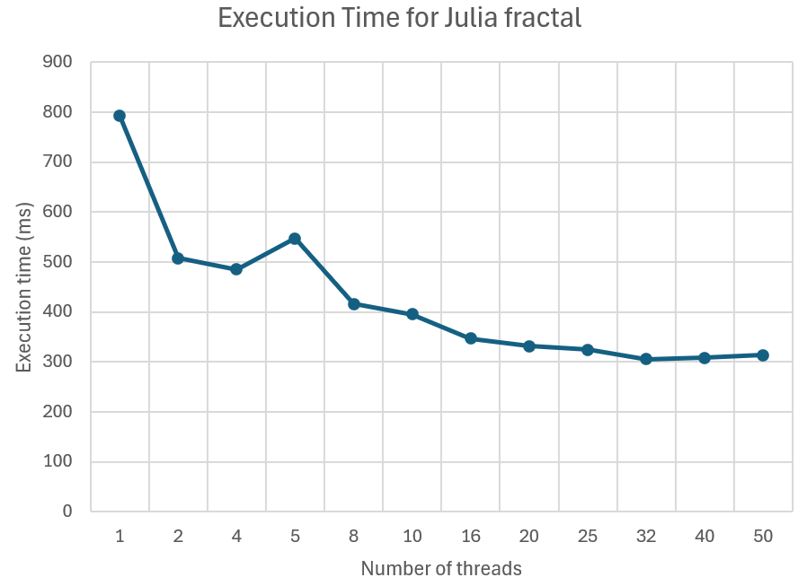

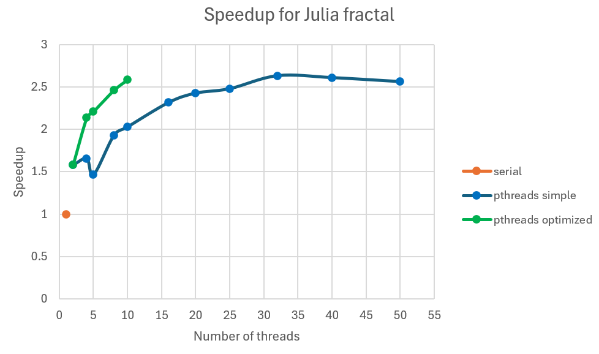

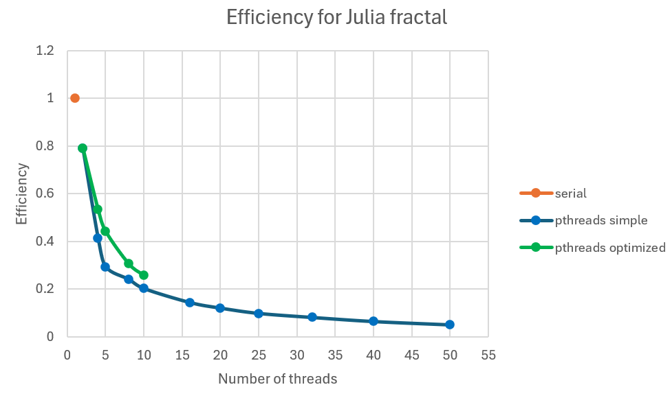

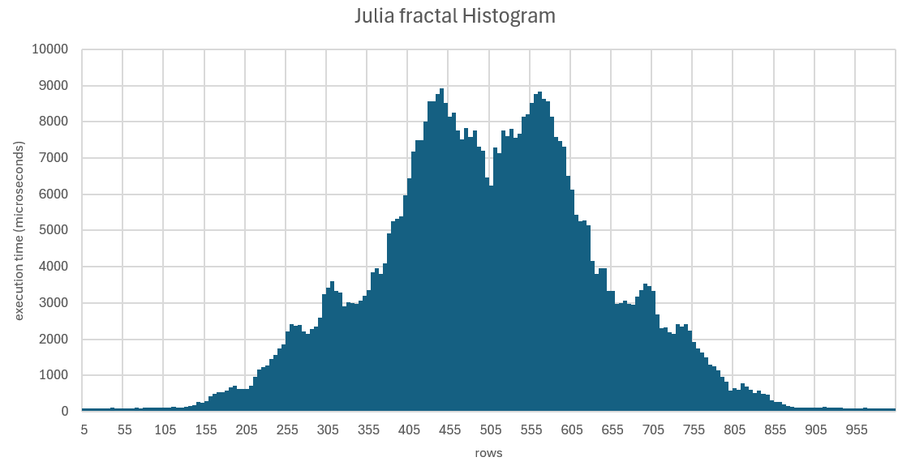

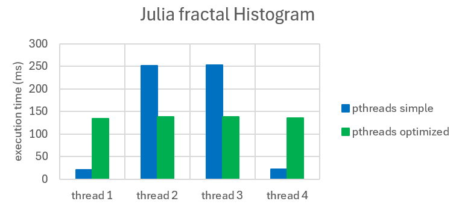
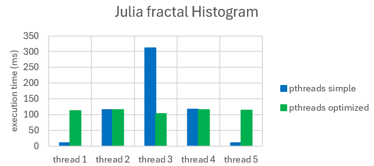

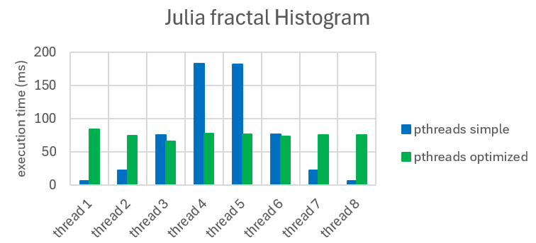
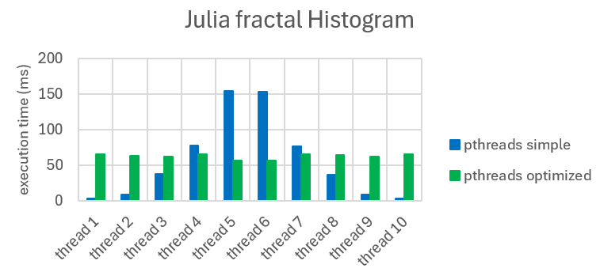

### Results for Mandelbrot fractal for 1000x1000 images with 1000 iterations:

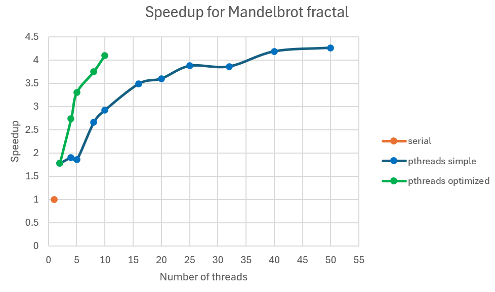

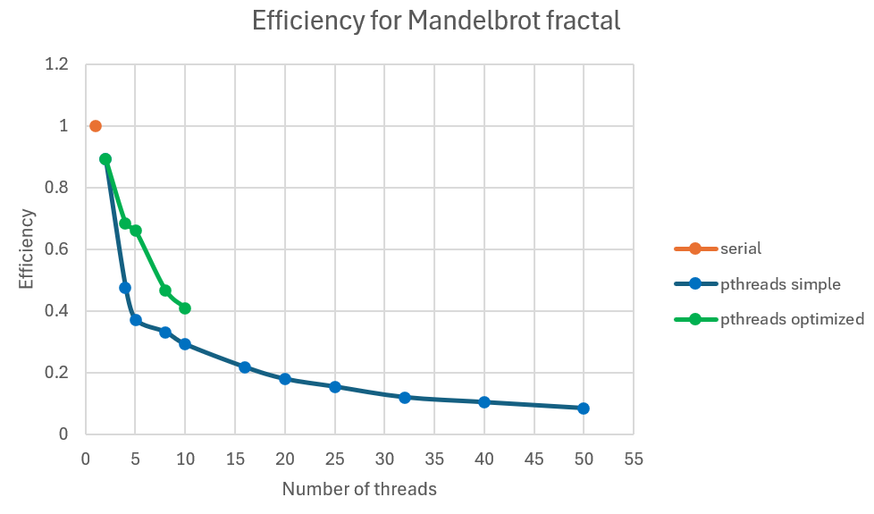

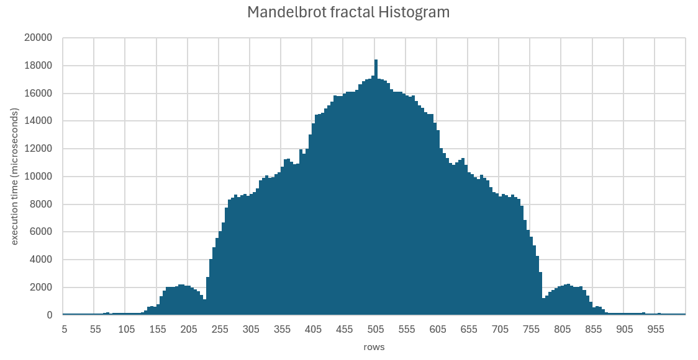

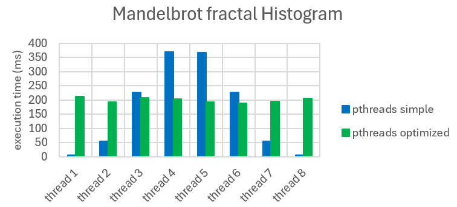
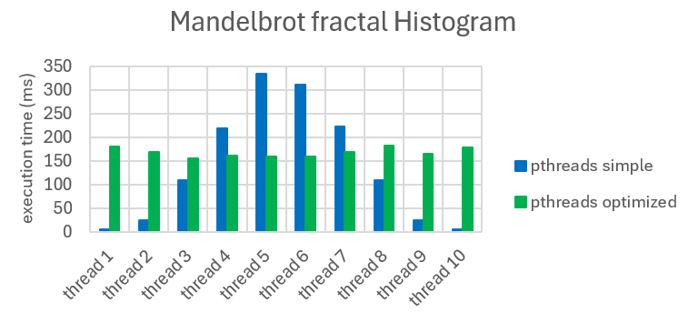

### Results for Tricorn fractal for 1000x1000 images with 1000 iterations:
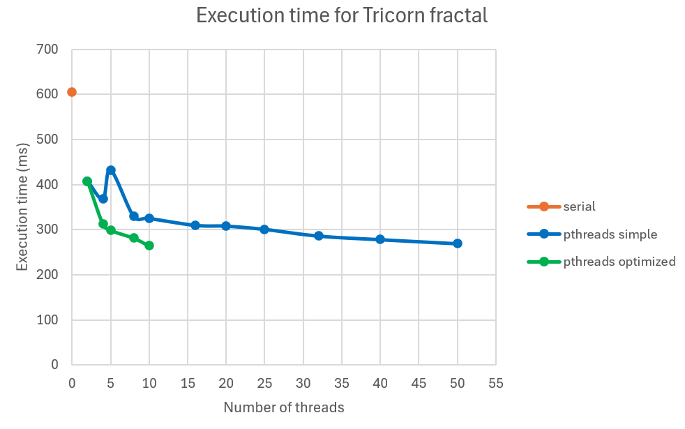

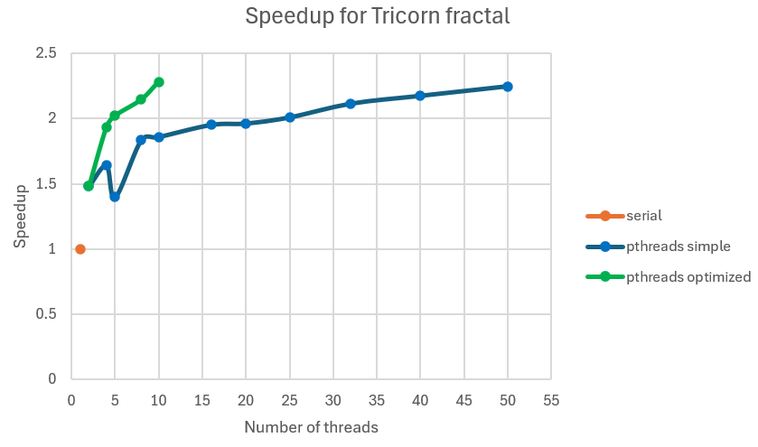

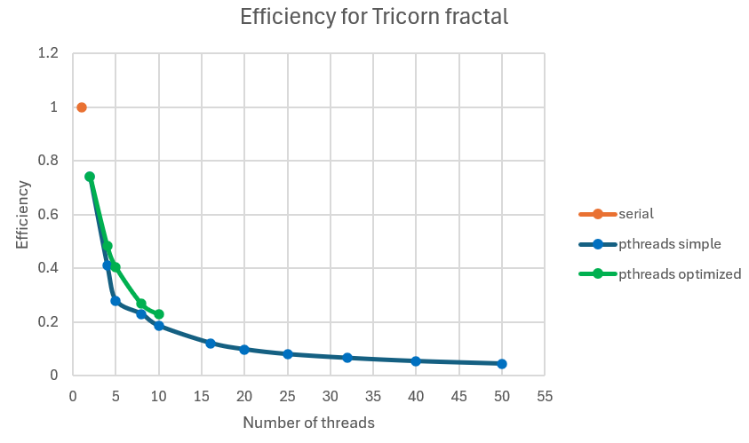

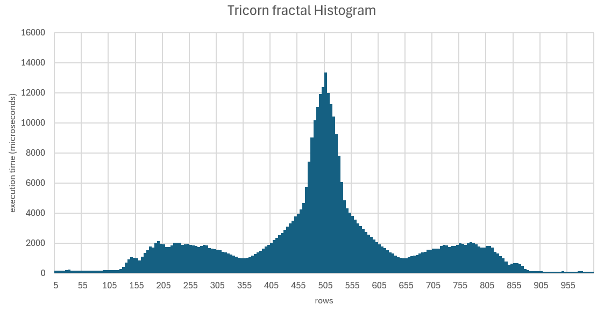

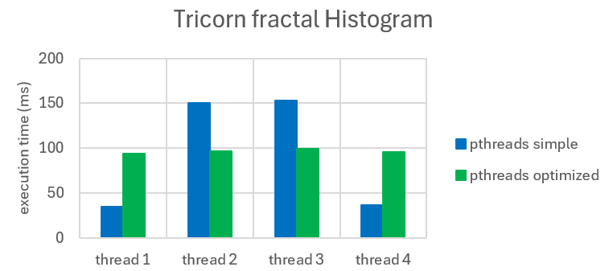
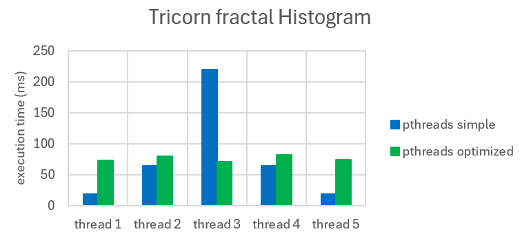

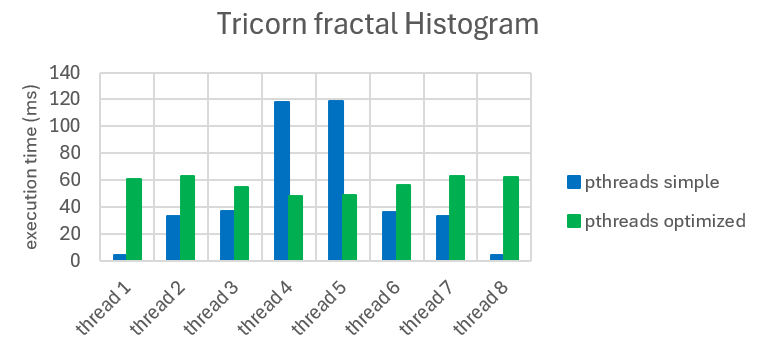
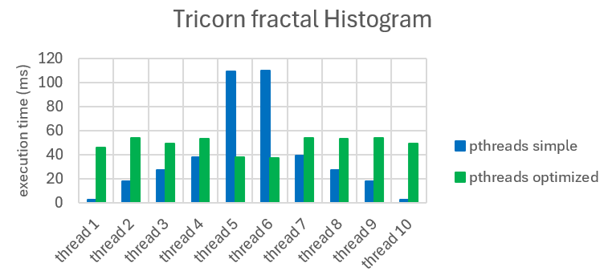
