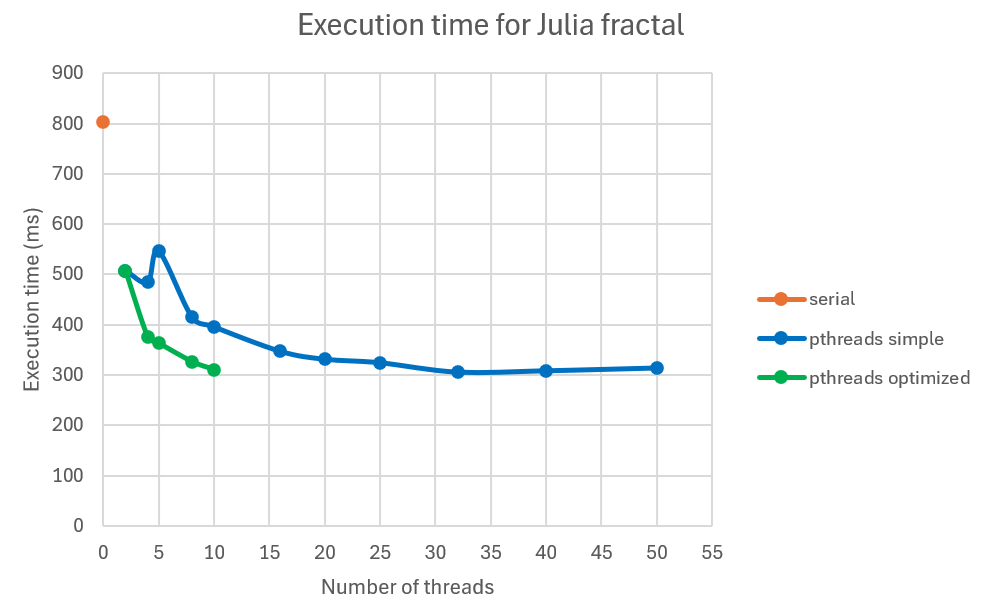

# Fractal Image Generation using pthreads
## pthreads research
Simple examples of pthreads implementations can be found in the **pthreads_labs_ex** directory.

## Analysis
The results can be found in the [**fractal_performance_measurement**](fractal_performance_measurement.xlsx) file.
### Results for Julia fractal:

## Fractal example

